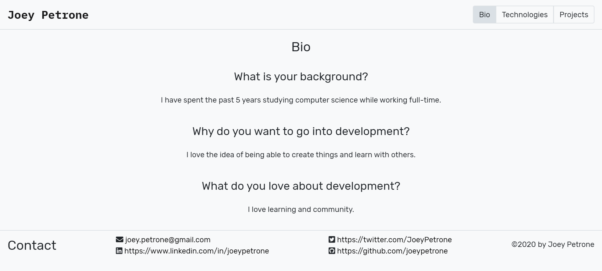
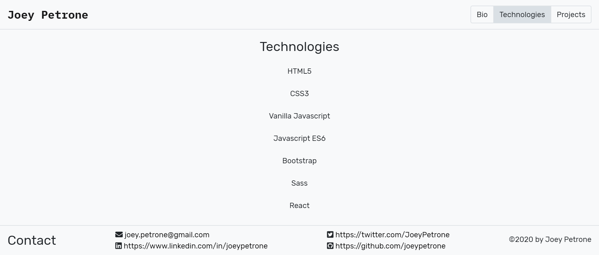
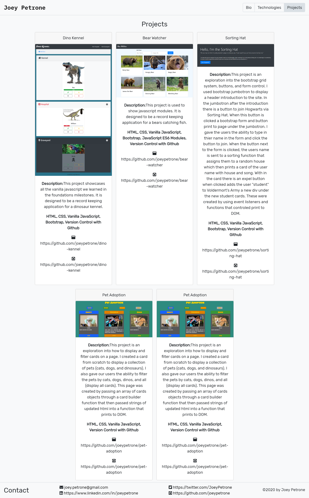

# Personal Bio Site

## Description 
The purpose of this site is to display information about me (Joey Petrone) pertaining to my journey through the Nashville Software School Fullstack Bootcamp (C#, .Net). This site will display a page that shows my Bio, Technologies learned, Projects, and Contact information. I expect this site to go through many phases as I progress through this course, but genereally it should stay fairly simple and easy to navigate. 

## Screenshots
### Bio Page (Home)

### Technologies Page

### Projects Page

## How to Run
1. Clone down this repo
2. Make sure you have http-server installed via npm. If not get it
[HERE](https://www.npmjs.com/package/http-server)
3. On your command line run `hs -p 8080`
4. In your browser go to `https://localhost:8080`
